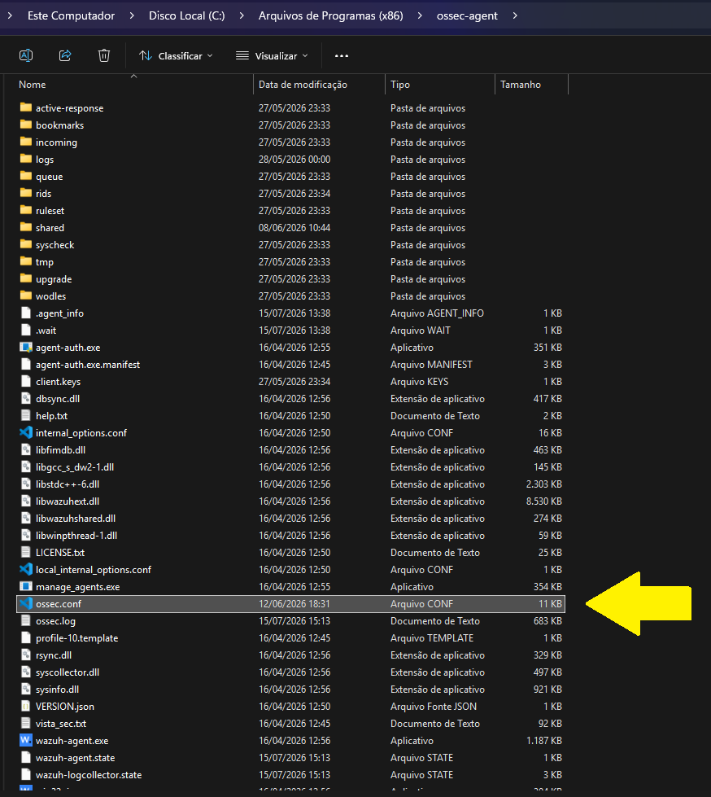
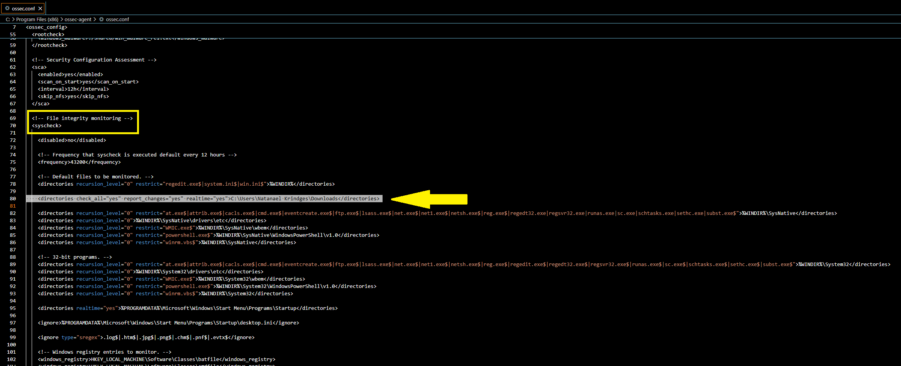
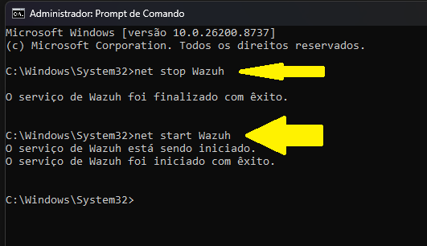
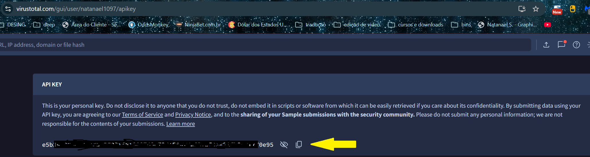
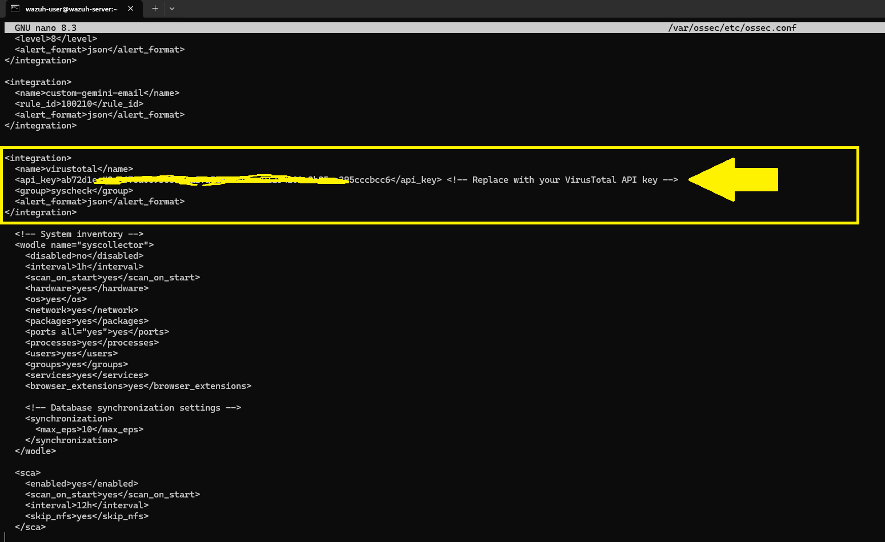

# INTEGRAÇÃO_WAZUH_COM_VIRUTOTAL

Guia passo a passo para integrar o Wazuh com o VirusTotal.

## 1. Editar arquivo de configuração do agente Wazuh

Abra o arquivo `ossec.conf` no caminho abaixo como administrador (usando VSCode, Bloco de Notas, etc.):

```text
C:\Program Files (x86)\ossec-agent\ossec.conf
```


Adicione a linha abaixo dentro da seção `<syscheck>`. **Não esqueça de trocar `SEU_USUARIO` pelo seu usuário:**

```xml
<syscheck>
...
    <directories check_all="yes" report_changes="yes" realtime="yes">C:\Users\SEU_USUARIO\Downloads</directories>
...
</syscheck>
```



## 2. Reiniciar Wazuh-Agent

No "CMD" com permissão de administrador, execute os seguintes comandos:

```cmd
net stop Wazuh
net start Wazuh
```



## 3. Registrar no VIRUSTOTAL

Acesse o site do VirusTotal para conseguir a sua chave de API (API Key):
[https://www.virustotal.com/](https://www.virustotal.com/)



## 4. Configurar WAZUH-MANAGER

Edite o arquivo de configuração do manager:

```bash
sudo nano /var/ossec/etc/ossec.conf
```


Adicione a seguinte configuração (substituindo `API_KEY` pela sua chave real do VirusTotal):

```xml
<integration>
  <name>virustotal</name>
  <api_key>API_KEY</api_key> <!-- Replace with your VirusTotal API key -->
  <group>syscheck</group>
  <alert_format>json</alert_format>
</integration>
```

## 5. Reiniciar WAZUH-MANAGER

Reinicie o serviço do manager:

```bash
sudo systemctl restart wazuh-manager
```


## 6. Criar arquivo eicar.txt

Crie o arquivo `eicar.txt` no diretório monitorizado (ex: a pasta Downloads configurada no passo 1) para gerar um alerta de teste no Wazuh. O conteúdo do arquivo deve ser exatamente este:

```text
X5O!P%@AP[4\PZX54(P^)7CC)7}$EICAR-STANDARD-ANTIVIRUS-TEST-FILE!$H+H*
```

## 7. Visualizar alerta no Wazuh Dashboard

Acesse o dashboard do Wazuh para visualizar os alertas gerados pela detecção do EICAR via integração com o VirusTotal.

## 8. Criar arquivo malwaretest.txt

Crie o arquivo de teste `malwaretest.txt` conforme a necessidade do seu laboratório.


